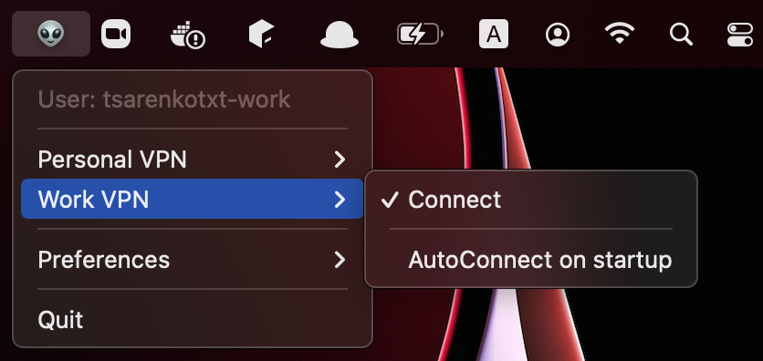

# VPN Handler

[](https://gitter.im/vpn-handler/vpn-handler)
[](https://github.com/tsarenkotxt/vpn-handler/releases)
[](https://github.com/tsarenkotxt/vpn-handler/releases)
[](https://en.wikipedia.org/wiki/MacOS)
[](https://en.wikipedia.org/wiki/Apple%E2%80%93Intel_architecture)
[](https://en.wikipedia.org/wiki/Apple_M1)
[](https://github.com/tsarenkotxt/vpn-handler/blob/main/LICENSE)

## What is it? 🤔

The `VPN Handler` is an application for handling the build-in VPN in the macOS:
   - auto connect.    
   - auto reconnect.
   - multi-user macOS environment & VPN management.

>The specific user - is the user for which you want to use a specific VPN. 
> For example, a workVPN must be enabled for a workUser, while for other users the workVPN must be disabled.

## How to use? 🤓

1. Download the [latest release](https://github.com/tsarenkotxt/vpn-handler/releases).
2. Launch the application.
3. Connect to the VPN.
4. _(Optional) enable automatic VPN connection when the application launches._
5. _(Optional) enable launch of the application on the macOS startup._

> Notifications may depend on your "Notifications & Focus"[^1] Preferences.

[^1]: [Notifications & Focus Preferences](https://support.apple.com/en-gb/guide/mac-help/mh40583/mac)



## White paper 📃

### Use cases

1. User can _select_ the VPN and _connect_ or _disconnect_ to the VPN.
2. User can _select_ the VPN and _enable_ or _disable_ automatic VPN connection when the application launches.
3. User can _enable_ or _disable_ launch of the application on the macOS startup.
3. User can _use_ multi-user macOS environment.

### Requirements

1. Tracks VPN connections:
    1. reconnect if the VPN connection is down.
    2. if the Internet connection is down, then wait until the Internet connection is established, then try to reconnect to the VPN.
    3. reconnection must be followed by the number of attempts, and each attempt must be delayed with increasing time.


2. Supports multi-user macOS environment:
    1. keep active VPN connections for the _selected_ user.
    2. disconnect from all selected VPNs when switching to _another_ users.
    3. reconnect to all selected VPNs when switching to the _selected_ user.


3. Supports preferences:
    1. automatically connect to the preferred VPNs when the application launches.
    2. automatically launch or not launch the application on the macOS startup.
    3. preferences must be stored permanently.


4. Tracks macOS Network Preferences:
    1. created VPN must be automatically added to the application.
    2. renamed VPN must be automatically detected in the application.
    3. deleted VPN must be automatically deleted from the application.


5. Pushes macOS notifications:
    1. connect to the VPN:
        1. Connecting  🐾 🚀
        2. Connected  🚀 🟢
        3. Connection failed  🚀 🔴
    2. reconnect to the VPN:
        1. Reconnecting  🐾 🎲
    3. disconnect from the VPN:
        1. Disconnecting  🐾 💣
        2. Disconnected  💣 🟢
        3. Disconnection failed  💣 🔴
    4. internet connection is down:
        1. Interrupted  🐾 💥
    5. VPN has been created or renamed:
        1. Detected new VPN  🐾 👀
    6. VPN has been deleted or renamed:
        1. Removing VPN 🐾 ❌

## Technologies 💾

- [Python](https://www.python.org/)
- [rumps](https://rumps.readthedocs.io/en/latest/)
- [py2app](https://py2app.readthedocs.io/en/latest/)

## Install & build 👾

1. Clone the repository:

```bash
git clone https://github.com/tsarenkotxt/vpn-handler.git
```

2. Open the project:

```bash
cd vpn-handler
```

3. Build and launch the application:
```bash
sh build_and_launch.sh
```

> rumps and py2app must be pre-installed.

## Known issues 🧐

The application is not signed[^2] and the following warning may appear on the first launch:

> “VPN Handler.app” can’t be opened because Apple cannot check it for malicious software.

[^2]: [Signing a Mac Product & Gatekeeper](https://developer.apple.com/developer-id/)

Workaround:

1. Open preferences - navigate to:  
```bash
"System Preferences" > "Security & Privacy" > "General"
```

2. Grant access - click to:
```bash
"Open Anyway" 
```

## Inspiration 🤠

- [Getting VPN to auto-reconnect on connection drop](https://apple.stackexchange.com/questions/42610/getting-vpn-to-auto-reconnect-on-connection-drop)
- [How to auto connect to VPN upon login/boot?](https://apple.stackexchange.com/questions/32392/how-to-auto-connect-to-vpn-upon-login-boot)
- [Secure traffic before connecting to WI-FI/VPN?](https://apple.stackexchange.com/questions/313308/secure-traffic-before-connecting-to-wifi-vpn)
- [VPN with two Mac users](https://apple.stackexchange.com/questions/130070/vpn-with-two-mac-users)
- [How to automatically connect VPN when connecting to a network?](https://apple.stackexchange.com/questions/199528/how-to-automatically-connect-vpn-when-connecting-to-a-network)
- [How do I automatically connect to a VPN when using Wi-Fi in OS X?](https://apple.stackexchange.com/questions/66302/how-do-i-automatically-connect-to-a-vpn-when-using-wi-fi-in-os-x)

## Contribute 🤩

Have a look through existing [Issues](https://github.com/tsarenkotxt/vpn-handler/issues)
and [Pull Requests](https://github.com/tsarenkotxt/vpn-handler/pulls) that you could help with.  
If you'd like to request a feature or report a bug,
please [create a GitHub Issue](https://github.com/tsarenkotxt/vpn-handler/issues/new/choose) using one of the templates provided.

## License 📜

[The MIT License](https://github.com/tsarenkotxt/vpn-handler/blob/main/LICENSE).
